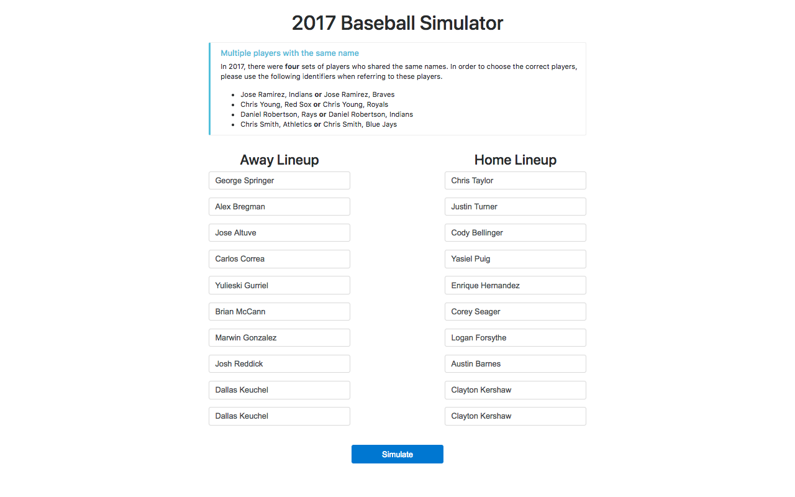
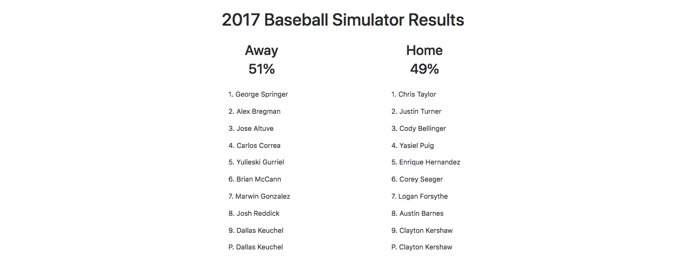

# Baseball Game Simulator in Django

**Run 500 simulations between two lineups and estimate the winning percentages.**

[Try the simulator at the Heroku app](https://baseballsimulator.herokuapp.com).

Name: Junsoo Derek Shin

Date: 26 February 2018

## Note:

- This is an extension project from [the one I wrote before](https://github.com/junsooshin/baseballsimulator). 

- The main focus for this project was to learn Django, speed up the simulator
  by storing data in the database, and deploying it on the web server.

## Using the simulator:

- Type in the player names for both lineups. The names have to be capitalized and
  exist in the FanGraphs database. If the names don't exactly match, the warning
  messages will show up at the top of the page, specifying which player's name
  was misspelled.

- The webpage takes about 15 seconds to load only at first and about 10 seconds
  to run the simulations.

- Example:
  

  

## Little test for the simulator:

- The files for this test are stored [in this folder](https://github.com/junsooshin/baseballsimulator-django/tree/master/baseballsimulator/custom/steamer), except for
the pickled baserunning data, which is stored in the parent folder.

- I wanted to see if the simulator works at all, so I decided to compare its
  simulation results to FiveThirtyEight's and FanGraphs's projected standings
  for the 2017 MLB season that had been generated before the season started. 
  Since both systems incorporate Steamer projections into their projections, I 
  also used them.
    
  I ran my simulator using the 2017 Steamer's player projections that was
  created pre-season and the 2016 Retrosheet baserunning stats. The games were
  simulated according to the team-matchups and starting lineups recorded in 
  the 2017 Retrosheet gamelogs.
    
  I ran each game just once for a season and for 100 seasons. (I also tried
  running 100 simulations per game and for just one season, but that did not
  do so well.) Then I averaged the win records for each team and rounded the 
  average to the nearest integer to form my projection for each team. So, the
  eventual results would answer, "on average, how many games would each team 
  win over a season?" and *not* "in how many games did the simulator correctly 
  predict the winner?"
    
  FiveThirtyEight's pre-season projections were already rounded to integers,
  and I rounded FanGraphs's pre-season projections to integers.
    
  Finally, I calculated the absolute mean errors, using the projected win
  records of the 30 teams and the actual results, for each projections.
    
  This simulator did slightly better than either projection system in this
  specific case and for particular measure. Of course, this by no means shows
  that this simulator is superior, since this was only for 2017. I took the
  result as a sign that my simulator could function properly, though.

- Projection sources

  [FiveThirtyEight's 2017 MLB Predictions](https://projects.fivethirtyeight.com/2017-mlb-predictions/)

  [FiveThirtyEight's Methodology](https://fivethirtyeight.com/features/how-our-2017-mlb-predictions-work/)

  [FanGraph's 2017 Projected Standings](https://www.fangraphs.com/standings/playoff-odds/fg/div?date=2017-04-01&dateDelta=&displayOption=)

  [FanGraphs's explanation on various projection systems](https://library.fangraphs.com/principles/projections/)

  [FanGraph's thoughts on their own projection system](https://blogs.fangraphs.com/lets-make-sure-were-honest-about-projections/)

  [Archive of Steamer's pre-season player projections](http://steamerprojections.com/blog/about-2/)

## Data sources:

- 2017 Batting (2017FanGraphsBatting.csv)
	
	<http://www.fangraphs.com/leaders.aspx?pos=all&stats=bat&lg=all&qual=0&type=0&season=2017&month=0&season1=2017&ind=0&team=0&rost=0&age=0&filter=&players=0>

- 2017 Pitching (2017FanGraphsPitching.csv)
	
	<http://www.fangraphs.com/leaderssplits.aspx?splitArr=&strgroup=season&statgroup=1&startDate=2017-3-1&endDate=2017-10-1&filter=IP%7Cgt%7C0&position=P&statType=player&autoPt=true&sort=19,-1&pg=0>

- 2017 League (2017FanGraphsLeague.csv)
	
	<http://www.fangraphs.com/leaders.aspx?pos=all&stats=bat&lg=all&qual=0&type=0&season=2017&month=0&season1=2017&ind=0&team=0,ss&rost=0&age=0&filter=&players=0>

- 2017 Play-by-play and Retrosheet BEVENT software for baserunning numbers
	
	<http://www.retrosheet.org/game.htm>

	<http://www.retrosheet.org/tools.htm>
	
	<http://www.retrosheet.org/datause.txt>

## Sources:

- Overall guide and inspiration

   <http://www.hardballtimes.com/10-lessons-i-learned-from-creating-a-baseball-simulator/>

- The Odds Ratio Method

   <http://www.insidethebook.com/ee/index.php/site/comments/the_odds_ratio_method/>

- Help on Django (This is mainly for me to look back on later)
	
   [Django Tutorial](https://docs.djangoproject.com/en/2.0/intro/tutorial01/)
   
   [Django Crash Course YouTube Video](https://www.youtube.com/watch?v=D6esTdOLXh4)
   
   [Virtualenv Documentation](https://virtualenv.pypa.io/en/stable/userguide/)
   
   [How to activate virtual environment](https://stackoverflow.com/questions/46896093/how-to-activate-virtual-environment-from-windows-10-command-prompt)
   
   [Setting django up to use mysql](https://stackoverflow.com/questions/19189813/setting-django-up-to-use-mysql)
   
   [Trying to run django script as standalone models error](https://stackoverflow.com/questions/34757353/trying-to-run-django-script-as-standalone-models-error)
   
   [Django revert last migration](https://stackoverflow.com/questions/32123477/django-revert-last-migration)
   
   [How to reset migrations in django 1.7](https://stackoverflow.com/questions/29253399/how-to-reset-migrations-in-django-1-7)
   
   [How to use external python script in django views](https://stackoverflow.com/questions/44759589/how-to-use-external-python-script-in-django-views)

   [How to style django forms with bootstrap](https://www.techinfected.net/2016/11/style-django-forms-with-bootstrap.html)
   
   [BootStrap forms](https://getbootstrap.com/docs/4.0/components/forms/#form-grid)
   
   [Django set field value after a form is initialized](https://stackoverflow.com/questions/813418/django-set-field-value-after-a-form-is-initialized)

   [Deploying Django to production](https://developer.mozilla.org/en-US/docs/Learn/Server-side/Django/Deployment)
   
   [Deploying Django on Heroku](https://devcenter.heroku.com/articles/django-app-configuration)
   
   [getting started with postgresql on mac osx](https://www.codementor.io/engineerapart/getting-started-with-postgresql-on-mac-osx-are8jcopb)

- Help on Python and Pandas (For future references as well)
   
   [Import error no module named pandas indexes](https://stackoverflow.com/questions/37371451/importerror-no-module-named-pandas-indexes)
   
   [Combine multiple text files into one text file using python](https://stackoverflow.com/questions/17749058/combine-multiple-text-files-into-one-text-file-using-python)
   
   [How to get full path of current files directory in python](https://stackoverflow.com/questions/3430372/how-to-get-full-path-of-current-files-directory-in-python)
   
   [Pandas dataframe performance](https://stackoverflow.com/questions/22084338/pandas-dataframe-performance)
   
   [How to store a dataframe using pandas](https://stackoverflow.com/questions/17098654/how-to-store-a-dataframe-using-pandas)
   
   [What is pickle in python](https://pythontips.com/2013/08/02/what-is-pickle-in-python/)
   
   [Guide to python profiling cprofile concrete case](https://julien.danjou.info/guide-to-python-profiling-cprofile-concrete-case-carbonara/)

   [How to enumerate in Django template](https://stackoverflow.com/questions/5013367/how-to-run-this-code-in-django-template)

## Things to be implemented in the future:

- There are a lot of things to be implemented to refine the baseball simualtor
  itself, including pitcher management, using multiple season data, and using
  projection data to list a few.
